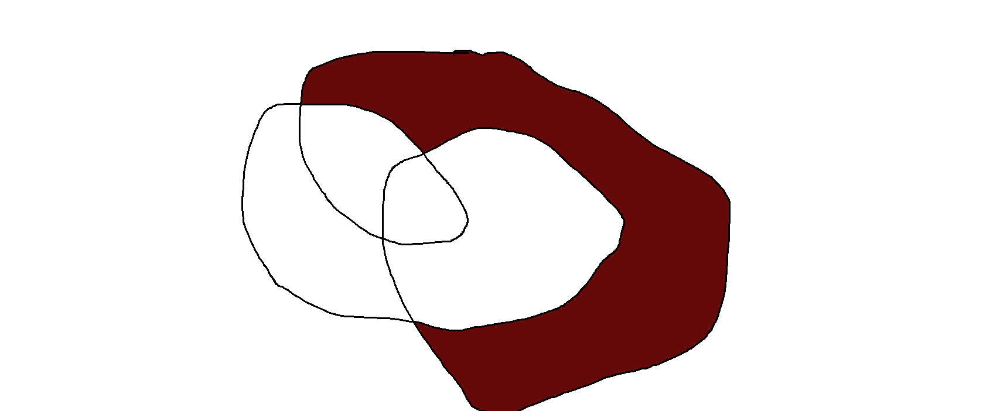

# floodfill
simple c++ cli tool to fill a region on png image()
## Compiling
```
$> g++ -lpng main.cpp
```
## usage
```
$> ./a.out 1.png x y r g b (a) 2.png
```
where 1 is input file and 2 is output file
Here are example of execution with some arbitrary coordinates and color


